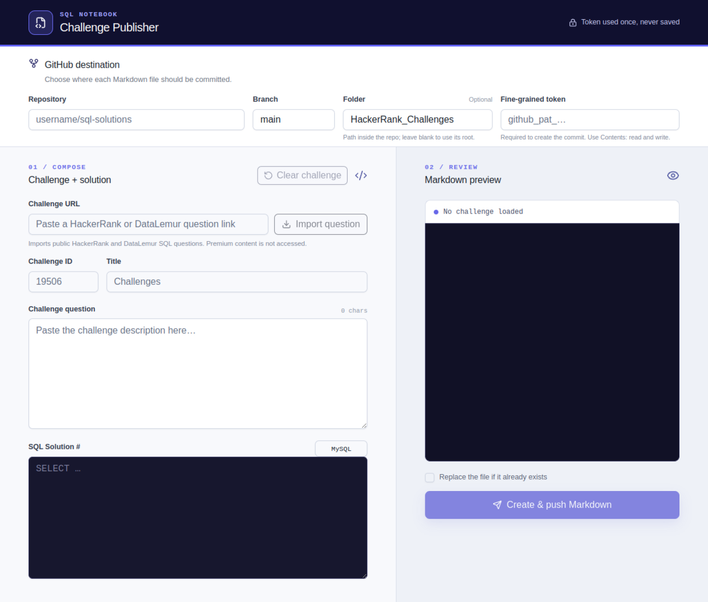

# SQL Challenge Journal

## Description

SQL Challenge Journal is a reusable way for anyone to organize and store their SQL practice solutions on GitHub. Each challenge is saved as an individual Markdown file containing the public HackerRank or DataLemur problem statement, a link to the original challenge, and the user's SQL solution.

This repository demonstrates the output of the [SQL Notebook Publisher](https://sql-challenge-publisher.das-reemika.chatgpt.site/), a public web app that imports HackerRank and DataLemur SQL challenge details, creates a consistent Markdown document, and commits it to a GitHub repository selected by the user. Anyone can use the app with a repository and GitHub token they control.

## Snap of SQL Notebook Publisher web app

## Step-by-step guide to use the web app

1. Open the [SQL Notebook Publisher](https://sql-challenge-publisher.das-reemika.chatgpt.site/).
2. Create or choose a GitHub repository where you have permission to commit files.
3. In **Repository**, enter the destination in `owner/repository` format—for example, `your-username/sql-challenge-journal`.
4. In **Branch**, enter an existing branch in that repository. Use `main` unless you intentionally want the files on another branch.
5. In **Folder**, enter the directory that should contain the Markdown files. The app uses `HackerRank_Challenges` or `DataLemur_Challenges` when the provider defaults are selected. Leave it blank to save files at the repository root.
6. Create and enter a fine-grained GitHub token:
   1. Open GitHub's [New fine-grained personal access token](https://github.com/settings/personal-access-tokens/new) page. You can also review GitHub's [personal access token guide](https://docs.github.com/en/authentication/keeping-your-account-and-data-secure/managing-your-personal-access-tokens).
   2. Enter a descriptive **Token name**, such as `SQL Challenge Publisher`, and choose an expiration date.
   3. Set **Resource owner** to the account or organization that owns the destination repository. Organization-owned repositories may require an administrator to approve the token.
   4. Under **Repository access**, select **Only select repositories**, then choose the repository entered in step 3.
   5. Under **Repository permissions**, find **Contents** and select **Read and write**. No additional repository permissions are required for publishing these Markdown files.
   6. Select **Generate token**, copy the token immediately, and paste it into the web app's **Fine-grained token** field.
   7. Keep the token private. The app uses it only for the GitHub request and does not save it. Revoke or rotate it from GitHub settings if it is ever exposed.
7. Paste an individual public HackerRank or DataLemur SQL question link into **Challenge URL**. Do not paste a question-catalog page.
8. Select **Import question**. The app detects the provider and imports the public challenge description, ID, title, and available SQL dialect. DataLemur premium questions are not accessed.
9. Review the imported question, then paste your accepted query into **SQL Solution #**. Update the SQL dialect if necessary.
10. Review the generated Markdown and filename. HackerRank files follow `<Challenge ID>_<Title>.md`, such as `12889_The_PADS.md`. DataLemur files follow `DataLemur_<Challenge ID>_<Title>.md`, such as `DataLemur_31_Page_With_No_Likes.md`.
11. Select **Create & push Markdown**. If the filename already exists, enable **Replace the file if it already exists** only when you intentionally want to overwrite it.
12. Open the published file from the success link. Select **Clear challenge** to start the next problem while keeping your GitHub destination settings available.
