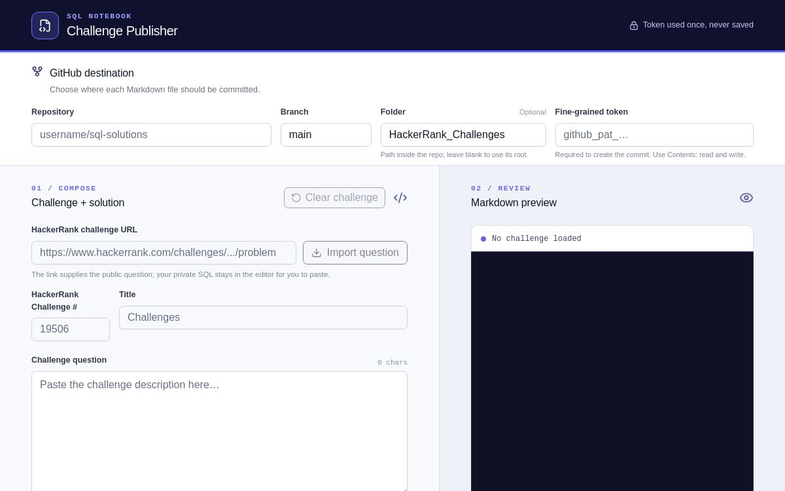

# SQL Challenge Journal

## Description

SQL Challenge Journal is a collection of my SQL practice solutions. Each challenge is stored as an individual Markdown file containing the HackerRank problem statement, a link to the original challenge, and my SQL solution.

This repository is updated through the [SQL Notebook Publisher](https://sql-challenge-publisher.das-reemika.chatgpt.site/), a public web app that imports HackerRank challenge details, creates a consistent Markdown document, and commits it to a GitHub repository selected by the user. Anyone can use the app with a repository and GitHub token they control.

## Snap of SQL Notebook Publisher web app

## Step-by-step guide to use the web app

1. Open the [SQL Notebook Publisher](https://sql-challenge-publisher.das-reemika.chatgpt.site/).
2. Create or choose a GitHub repository where you have permission to commit files.
3. In **Repository**, enter the destination in `owner/repository` format—for example, `your-username/sql-challenge-journal`.
4. In **Branch**, enter an existing branch in that repository. Use `main` unless you intentionally want the files on another branch.
5. In **Folder**, enter the directory that should contain the Markdown files, such as `HackerRank_Challenges`. Leave it blank to save files at the repository root.
6. Enter a fine-grained GitHub token that is restricted to your selected repository and has **Contents: Read and write** permission. The app uses the token only for the GitHub request and does not save it.
7. Paste a HackerRank problem link into **HackerRank challenge URL**.
8. Select **Import question**. The app imports the public challenge description and fills in the challenge number and title.
9. Review the imported question, then paste your accepted query into **SQL Solution #**. Update the SQL dialect if necessary.
10. Review the generated Markdown and filename. Files follow the format `<HackerRank Challenge #>_<Title>.md`, for example `12889_The_PADS.md`.
11. Select **Create & push Markdown**. If the filename already exists, enable **Replace the file if it already exists** only when you intentionally want to overwrite it.
12. Open the published file from the success link. Select **Clear challenge** to start the next problem while keeping your GitHub destination settings available.
